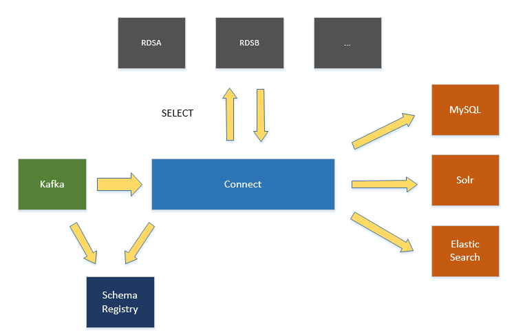

# index system base on kafka connect

`SIS`是一个`kafka connect`的实现，它能基于`kafka`提供的数据，通过反查数据库，丰富数据内容。最后丰富，聚合，过滤后的数据写入目标数据源内。
`SIS`需要配合[confluent](https://www.confluent.io/)体系和`debezium`，使用基于`schema registry`的序列化器。

目前支持写入`solr`, `elasticsearch`，`mysql`（`Mysql`目前不支持删除）。

## 使用前必看

项目能够运行的前提条件:

1. `kafka`版本`1.0.0`;
2. `kafka topic`数据需要来自`debezium`，简单的理解: 强依赖`debezium`;

## 文档

[文档地址](docs/目录.md)

## 特点

1. 基于`kafka connect`，天然支持高可用。
2. `kafka connect`完备的`commit`处理。
3. 支持数据库反查，聚合数据。
4. 支持写入`solr`,`es`,`mysql`，开发者也可以实现自己的写入端。
5. 支持设置`task`个数，并行处理（并行个数与`kafka topic partition`个数相关）。

## TODO

- [ ] 完善文档。

## Any Problem

`email`: `sweatott@gmail.com`

# 其它

欢迎各位`PR`. `To be better`
