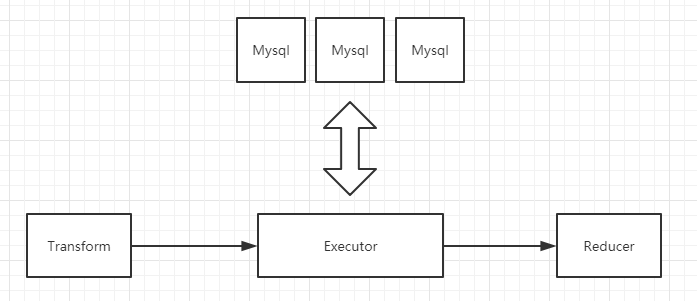

# Executor 原理

`Executor`用来聚合数据，能够反查数据库，丰富`sis record`内容，将写入端需要的所有字段值都准备好。

对于`sis`来说，上游`Transform`交付的`record`应该都是合法的。在`executor`层配置的`SQL`语句会结合`record`，执行一次或多次`SQL`语句，丰富、聚合数据，获取所有必要的字段值。

`Executor`最会会将聚合后的`record`交付给`Reducer`;
