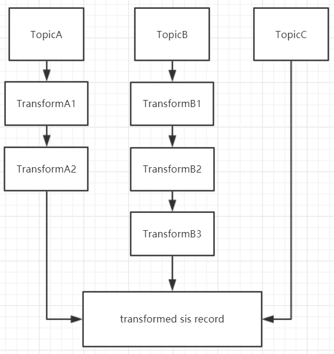

# Transform 工作模型

`SIS`能够订阅多个`kafka topic`, 从每个`topic`获取的数据，都会被此`topic`对应的零或多个`transform`处理、转化、过滤; 最终产生新的`sis record`。对于不同的`topic`，经过不同的`transform`处理之后，要保证最后产生的`record`是 *同一纬度*。

 

如上图中`sis`订阅了`3`个`topic`，不同的`topic`都有自己的链式`transform`处理逻辑，同时可以发现不同的`topic`，`transform`个数也是可以不同的。可以简单地把`topic`到最后产生新的`record`这部分称为 *管道模型*。 多个管道模型最后产生的数据必须是 *同一维度*，也就是说管道`A B C`，最后产生的`record`里的字段必须是一致的(即使有些字段的值为(`null`)。

举个例子:

1. `TopicA`获取的`record`有以下几个字段`a, b`; 
2. `TopicB`字段有`b,c`; 
3. `TopicC`字段有`d,e`;
4. 最后`transform`处理后的产生的数据字段必须为`c`;

对于`TopicA, TopicB`的管道模型，可以直接从原始`record`里获取`c`字段；而对于`TopicC`它的原始数据里不存在`c`字段，它就需要通过`SqlTransform`，从数据库中根据现有的`d,e`关联字段，反查出需要的`c`字段。这样`3`个不同的管道模型，最后产出了 *同一纬度*  的数据。

获取到 *同一纬度*  的新`sis record`后，`transform`模块的工作到此结束，新的数据会被交付给下游`executor`;

#  有哪些 Transform

根据链式处理的顺序介绍（先介绍的`transform`，在同一管道模型中会先于后者开始工作）

1. `FieldTransform`根据配置文件，如果从数据库获取的变更数据，指定的字段变更前后没有改变，则过滤此`record`; (`SIS`需要配和`debezium`项目 [`debezium`链接](https://debezium.io/))
2. `RecordTransform`移除`before`的数据，并将`after`内的数据展开; (`SIS`需要配和`debezium`项目 [`debezium`链接](https://debezium.io/) `debezium`产生的数据会有`before`和`after`概念)
3. `FilterTransform` 根据配置文件(例如某些值必须大于或小于指定值等)，过滤掉不合法的`record`;
4. `PlacehholderTransform`根据配置文件，从`record`内直接提取需要的字段，解析配置的占位符;
5. `SqlTransform`根据配置文件，使用关联字段反查数据库，获取需要的值。(**3和4在一个管道模型中，不能同时存在**)